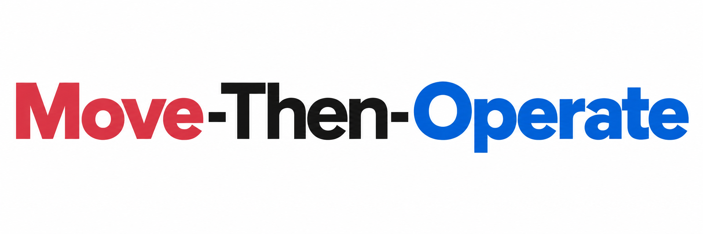

<p align="center">
  <a href="https://arxiv.org/abs/2604.23620"><strong>arXiv: 2604.23620</strong></a>
  &nbsp; | &nbsp;
  <a href="https://proceedings.mlr.press/v306/xu26aa.html"><strong>ICML 2026 / PMLR</strong></a>
</p>

<h1 align="center">
  
</h1>

Official implementation of **[Move-Then-Operate: Behavioral Phasing for Human-Like Robotic Manipulation](https://arxiv.org/abs/2604.23620)** (ICML 2026).

Move-then-Operate (MTO) is a hard-switch dual-expert vision-language-action policy built on [OpenPI](https://github.com/Physical-Intelligence/openpi). A shared vision-language model predicts MOVE or OPERATE; inference runs one selected action expert for the entire action chunk. MOVE and OPERATE use **separate normalization statistics**.

This release provides phase annotation, LeRobot v3/HDF5 data reading, JAX training, checkpoint resume, independent inference, and an MTO-owned RoboTwin evaluation loop. The eight-GPU commands are training configurations; their memory use and convergence still need deployment validation. See [LICENSE](LICENSE) and [NOTICE](NOTICE) for attribution.

## Install and deployment paths

Use Python 3.11. On Linux with CUDA 12, install the locked MTO environment from the repository root:

```bash
uv sync --extra cuda12 --frozen
```

For CPU development, use `uv sync --frozen`. Keep RoboTwin's simulator environment separate from the MTO environment. RoboTwin needs its own installed robot/task assets and the client packages `numpy`, `msgpack`, `websockets`, and `typing_extensions`; it does not need JAX. The MTO reader uses PyArrow and PyAV, including AV1 decoding, without a LeRobot package dependency.

Set deployment paths in each shell/container. These examples use mounted storage, not repository contents:

```bash
export MTO_DIR=/workspace/Move-then-Operate
export MTO_PY="$MTO_DIR/.venv/bin/python"
export DATA_ROOT=/data/robotwin2_lerobot
export LABELS_ROOT=/data/mto/labels
export RUN_ROOT=/data/mto/runs
export PI0_PARAMS=/models/pi0_base/params
export TOKENIZER_PATH=/models/paligemma_tokenizer.model
export CHECKPOINT_BASE_DIR="$RUN_ROOT/checkpoints"
export NORM_DIR=/data/mto/norm/all_tasks_clean_h30
export MOVE_NORM_STATS_PATH="$NORM_DIR/move.json"
export OPERATE_NORM_STATS_PATH="$NORM_DIR/operate.json"
export ROBOTWIN_ROOT=/workspace/RoboTwin
export ROBOTWIN_PY="$ROBOTWIN_ROOT/.venv/bin/python"
cd "$MTO_DIR"
```

`PI0_PARAMS` must be the JAX parameter directory. If base assets are unavailable, download them once:

```bash
"$MTO_PY" -m mto.download_assets --output-dir /models/mto_base_assets
```

Use the parameter and tokenizer paths printed by that command. Once installed and provisioned, training, inference and tests use local assets. When crossing containers, mount the dataset, label root, base parameters, tokenizer, run directory and RoboTwin assets into the process that uses them; adjust exported paths to each container's mount points. A copied virtual environment is not portable across Python installations or operating systems. Model and simulator processes must be able to reach the inference service over the configured host/port.

## Organize data and choose training/evaluation sets

Expected LeRobot v3.0 layout:

```text
DATA_ROOT/<task>/<split>/
  meta/info.json
  meta/tasks.parquet
  meta/episodes/chunk-*/file-*.parquet
  data/chunk-*/file-*.parquet
  videos/observation.images.cam_high/chunk-*/file-*.mp4
  videos/observation.images.cam_left_wrist/chunk-*/file-*.mp4
  videos/observation.images.cam_right_wrist/chunk-*/file-*.mp4
LABELS_ROOT/<task>/<split>/auto_labels_v2/
  episodeN_phases_labels_thinking.json
  episodeN_phases_labels_thinking.meta.json
```

Leave task selection empty to train all available tasks. The initial recipe uses all tasks with `demo_clean` for labeling, statistics and training. `demo_clean` and `demo_randomized` identify data/environment settings; they do not establish disjoint episode or seed sets.

For task-level holdout, pass the same explicit training task names to annotation (`--task_names`), statistics (`--task-names`), and training (`--task-names`, or `TASK_NAMES` in the shell wrappers). Evaluate with a separate local task-list file. For episode-level holdout, export separate complete datasets with their own consistent episode metadata. Do not split by video/Parquet filename or assign phases/chunks from one episode to different sets. Compute normalization on the training set only. This repository has no random episode train/validation splitter or validation dataloader.

See [data.md](docs/data.md) for the joint14 layout, HDF5 preparation and exact action-window alignment.

## Annotate phases

Configure the Ark Responses deployment through the environment; no personal endpoint is built in:

```bash
read -r -s -p 'Ark API key: ' ARK_API_KEY; export ARK_API_KEY; echo
export ARK_MODEL_ID='<your-deployment-endpoint>'
export ARK_BASE_URL=https://ark.cn-beijing.volces.com/api/v3
"$MTO_PY" -m mto.auto_label \
  --data_format lerobot_v3 --root_dir "$DATA_ROOT" --labels_root "$LABELS_ROOT" \
  --split_names demo_clean --sample_fps 5 --max_frames 64 \
  --max_new_tokens 8192 --concurrency 5 --max_attempts 3
```

Rule `move_operate_alignment_v6` includes target-relative fine alignment, final controlled approach, full grasp/release and object repositioning in OPERATE. MOVE covers coarse travel, ordinary carrying and withdrawal. The annotator samples episode endpoints and measured gripper-event anchors, assembles synchronized head/left-wrist/right-wrist mosaics, creates a visual draft, then calibrates its boundaries with measured gripper timing. Empty-gripper preparation does not prove contact. Calibration may change boundaries while preserving subtask/phase structure and semantics.

`--gripper_event_threshold` controls the minimum per-frame change in recorded gripper units (default 0.02); `--event_context_frames` controls anchor context (default 2). Check these settings against the recording's gripper scale. Sampling is bounded by `--max_frames`; dense events share the budget. The default token budget includes reasoning and final output. Retry limits apply separately to each stage. Failed calibration never publishes a draft. Resume checks the labels and metadata, including rule, visual layout, temporal evidence, model and sampling. Failed jobs or an empty selection return exit code 1. Keep raw responses/error sidecars on deployment storage.

## Compute separate expert statistics

```bash
"$MTO_PY" -m mto.compute_norm_stats \
  --data-format lerobot_v3 --data-root "$DATA_ROOT" --labels-root "$LABELS_ROOT" \
  --split-names demo_clean --action-horizon 30 --normalize-method zscore \
  --num-samples-per-expert 50000 --seed 42 --output-dir "$NORM_DIR"
```

This produces `move.json`, `operate.json` and `data_manifest.json`. Review dataset selection, missing/invalid labels and phase counts in the manifest. Statistics sample the same phase-bounded windows used in training, separately for each expert. They include only physical dimensions and valid action rows. Recompute them when changing the training set, labels, horizon or action filtering.

## Train full parameters or LoRA on eight GPUs

The scripts run one JAX process with FSDP across eight visible devices: horizon 30, global batch 256, 100000 steps, checkpoint every 10000 steps, EMA 0.99, and automatic resume. They run in the foreground and inherit deployment paths from the environment.

```bash
read -r -s -p 'W&B API key: ' WANDB_API_KEY; export WANDB_API_KEY; echo
export WANDB_PROJECT=move-then-operate
export CUDA_VISIBLE_DEVICES=0,1,2,3,4,5,6,7
bash "$MTO_DIR/scripts/train_8gpu_full.sh"
```

For LoRA, run separately with its own experiment directory:

```bash
bash "$MTO_DIR/scripts/train_8gpu_lora.sh"
```

Defaults are `mto_full_h30_b256_100k_dim32zero` and `mto_lora_h30_b256_100k_dim32zero`. Set `EXP_NAME` to choose another run. Set `WANDB_ENABLED=false` for training without W&B. Optional `TASK_NAMES` is a space-separated training task list; unset it for all tasks. `SPLIT_NAMES` defaults to `demo_clean`. CLI overrides can be appended to a wrapper, such as `--num-steps 20000`. For a single GPU, append `--fsdp-devices 1 --batch-size 8` and set `CUDA_VISIBLE_DEVICES=0`. These examples do not assert that full-parameter batch 256 fits a particular GPU.

`pi0_base` initialization loads the VLM and copies the pretrained action Transformer into both experts. Action/state/time projections and the router are initialized independently. Training modes also include `frozen_vlm` and `lora_frozen_vlm` through `mto.train`. Full and LoRA runs require different experiment directories and matching inference structures.

Physical joint14 actions use chunk-anchor joint deltas and absolute grippers, normalized with their labeled expert's statistics. The remaining 18 model dimensions are padded to zero **after normalization** and supervised at every valid timestep. Their flow target is `noise - 0`. Time padding contributes no direct flow loss. Overall action MSE uses the valid-element denominator; router cross-entropy is averaged independently over samples. Training routes by ground-truth phase. `loss_mse_expert0/1_masked` reports each expert on its own ground-truth group; `valid_elements_expert0/1` reports the denominators. Legacy `loss_mse_expert0/1` still covers the whole batch. Loss magnitudes from the old 14-dimensional mask are not directly comparable.

## Resume and checkpoint contents

Repeat the same command and experiment name. A complete checkpoint restores model parameters, optimizer moments, EMA and step. If the run stopped before saving its first checkpoint, training starts at step 0 and reuses the existing `wandb_id.txt` when resume is enabled. The wrappers clear inherited `WANDB_RUN_ID` so another experiment's ID cannot replace the run's saved identity.

```text
CHECKPOINT_BASE_DIR/wide_camera_dual_expert/<experiment>/
  resolved_config.json
  data_manifest.json
  wandb_id.txt                       # when W&B is enabled
  assets/move.json
  assets/operate.json
  100000/params/
  100000/train_state/
```

Resume retains the saved model, data selection, normalization, optimizer and seed contract. Operational settings such as the total step budget, workers, logging/saving and device mesh may change. The data iterator and all random states are not restored exactly. With EMA enabled, exported `params` are EMA weights. LoRA checkpoints contain the full model tree, not only adapter deltas. Base weights and tokenizer remain independent deployment assets.

## Serve a checkpoint

Choose the matching architecture and the statistics archived in that training run:

```bash
export TRAIN_RUN="$CHECKPOINT_BASE_DIR/wide_camera_dual_expert/mto_full_h30_b256_100k_dim32zero"
export PARAMS_PATH="$TRAIN_RUN/100000/params"
export MOVE_NORM_STATS_PATH="$TRAIN_RUN/assets/move.json"
export OPERATE_NORM_STATS_PATH="$TRAIN_RUN/assets/operate.json"
CUDA_VISIBLE_DEVICES=0 XLA_PYTHON_CLIENT_PREALLOCATE=false \
"$MTO_PY" -m mto.infer \
  --params-path "$PARAMS_PATH" --tokenizer-path "$TOKENIZER_PATH" \
  --training-mode full --action-horizon 30 --model-action-dim 32 \
  --move-norm-stats-path "$MOVE_NORM_STATS_PATH" \
  --operate-norm-stats-path "$OPERATE_NORM_STATS_PATH" \
  --normalize-method zscore --num-steps 10 --host 127.0.0.1 --port 9700
```

For a LoRA checkpoint, use its run path and `--training-mode lora`. Preserve any explicit model variant overrides. The service compiles both expert decoders before exposing `/healthz`. Each request then hard-selects one expert, uses that expert's state/action normalization, and holds the route fixed throughout flow integration. Predictions are returned as absolute joint commands by adding the raw chunk-anchor joints after denormalization. No ground-truth phase is supplied at inference.

## Evaluate with RoboTwin

`mto.eval_robotwin` owns the policy evaluation loop. It uses the installed RoboTwin environment's task, robot and camera configuration, scene screening, success test and action budget. It supports both `task_config/` and `env_cfg/task_config/` configuration layouts through `envs.CONFIGS_PATH`. Install/provision RoboTwin separately and record the deployed revision alongside results; newer simulator changes still require remote verification.

Stop the manually started server before running this wrapper, which manages its own server:

```bash
export RUN_CONFIG="$TRAIN_RUN/resolved_config.json"
export TASK_MANIFEST="$TRAIN_RUN/data_manifest.json"
export EVAL_ROOT="$RUN_ROOT/eval"
RUN_ID=mto_full_clean_eval TEST_NUM=100 EXEC_STEPS=30 \
TASK_CONFIGS=demo_clean MODEL_GPUS=0 SIM_GPUS=0 SERVER_PORT_BASE=9700 \
bash "$MTO_DIR/eval_robotwin_mto_resumable.sh"
```

For held-out tasks, unset `TASK_MANIFEST` and set `TASK_LIST` to a local text file containing one task name per line. `TASK_CATALOG` alternatively selects a YAML file containing a `tasks` list. `TASK_CONFIGS` is a setting name, not a path. Run randomized evaluation separately with `TASK_CONFIGS=demo_randomized` and a different `RUN_ID`.

The adapter sends current three-camera RGB, raw joint14 state and task instruction. It executes absolute qpos with `take_action(..., action_type="qpos")`, observes after `EXEC_STEPS`, and stops at success or the environment action limit. `EXEC_STEPS` must not exceed the checkpoint horizon. The model resets with the actual accepted scene seed. Repeat the same command and run ID to resume the same evaluation. Results include requested and completed trials, missing trials, success rates, route/action traces and videos. A partial result does not establish full benchmark success.

## Offline checks and release scope

```bash
cd "$MTO_DIR"
JAX_PLATFORMS=cpu "$MTO_PY" -m unittest discover -s tests -v
git ls-files -z > /tmp/mto-publication-files
"$MTO_PY" scripts/check_release.py --root "$MTO_DIR" --file-list /tmp/mto-publication-files
```
## Citation
```
@InProceedings{pmlr-v306-xu26aa,
  title     = {Move-Then-Operate: Behavioral Phasing for Human-Like Robotic Manipulation},
  author    = {Xu, Haoming and Lei, Lei and Gu, Jie and Tang, Chu and Chen, Jingmin and Wang, Rui-Qi},
  booktitle = {Proceedings of the 43rd International Conference on Machine Learning},
  pages     = {141250--141264},
  year      = {2026},
  editor    = {Zhang, Tong and Dudik, Miroslav and Jaggi, Martin and Agarwal, Alekh and Li, Sharon and Schuurmans, Dale and Zhu, Jerry and Berkenkamp, Felix and Dong, Hanze and Bietti, Alberto},
  volume    = {306},
  series    = {Proceedings of Machine Learning Research},
  month     = {06--11 Jul},
  publisher = {PMLR},
  url       = {https://proceedings.mlr.press/v306/xu26aa.html}
}
```
